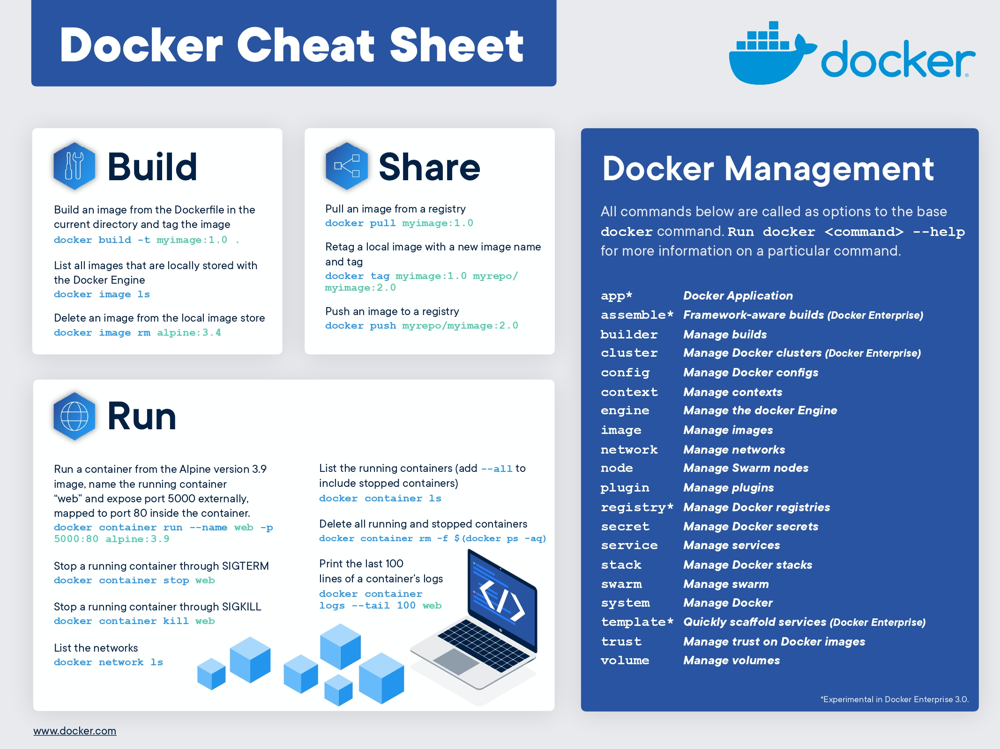
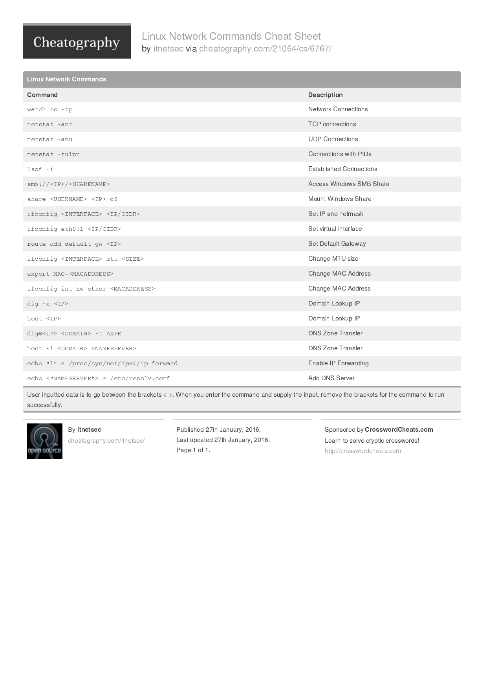
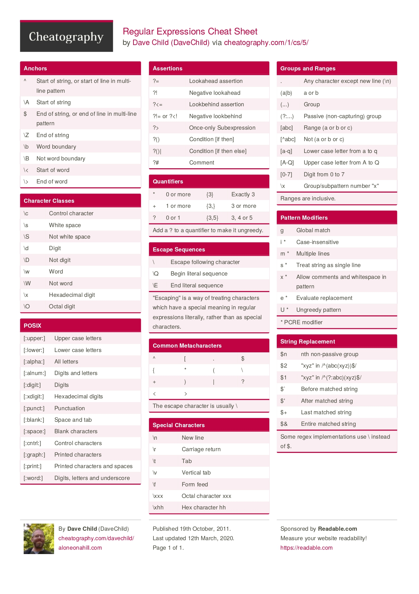
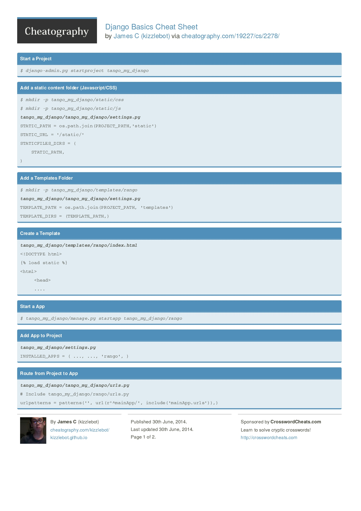
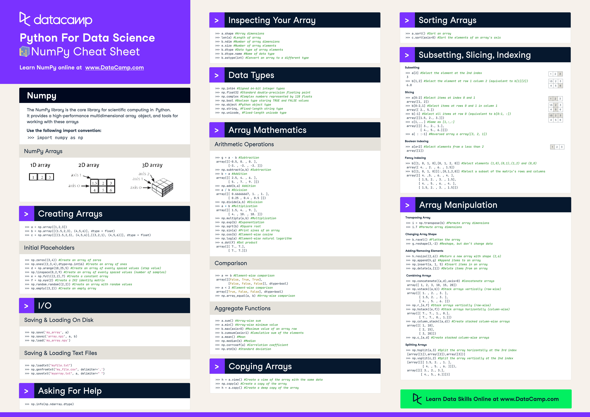
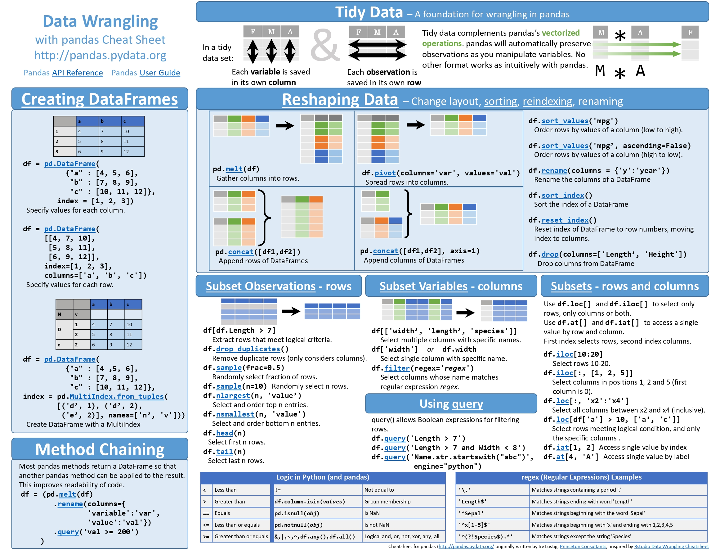
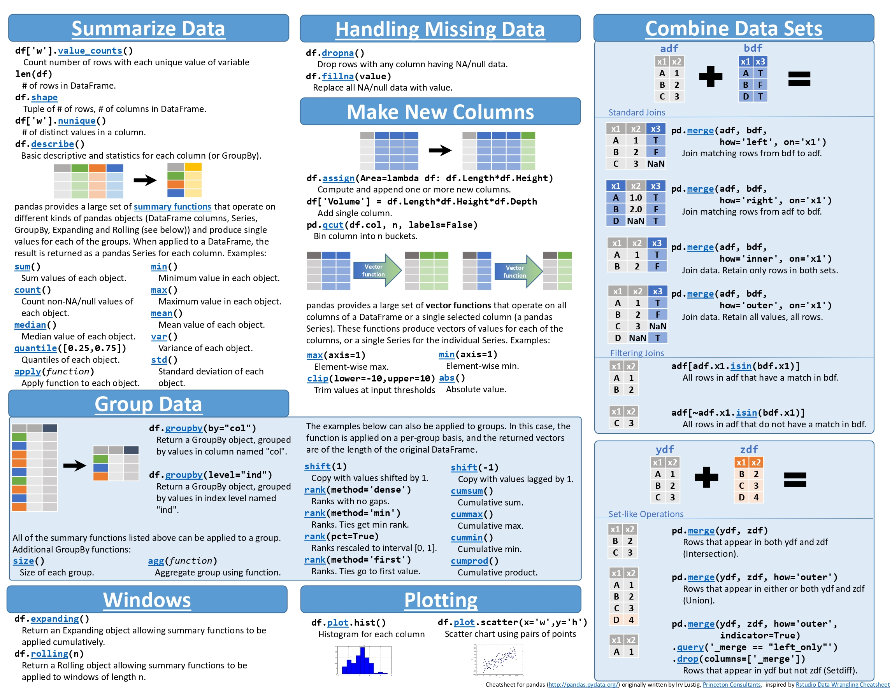
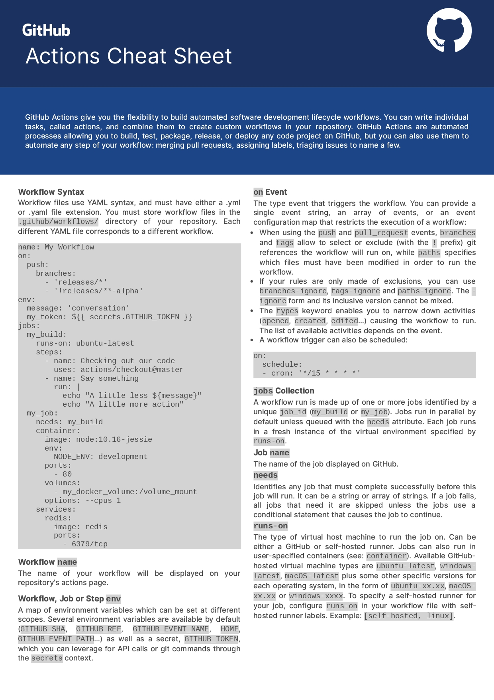
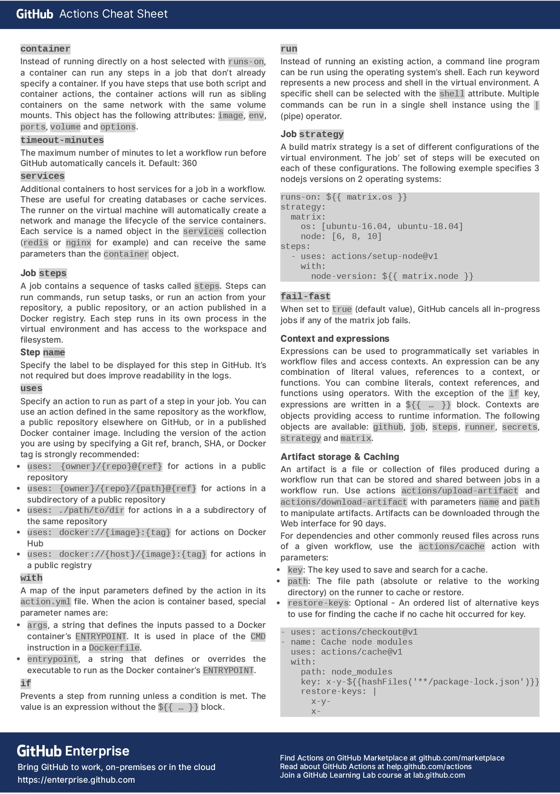

# Cheatsheets
## Docker
### Basics
- 1

## Linux
### Networking
- 1

## General
### RegExp
- 1

## Python
### Django
- Basics

### NumPy
- Cheatsheet #1

### Pandas
- Cheatsheet #1

## YAML
### Github Actions
- Cheatsheet #1

