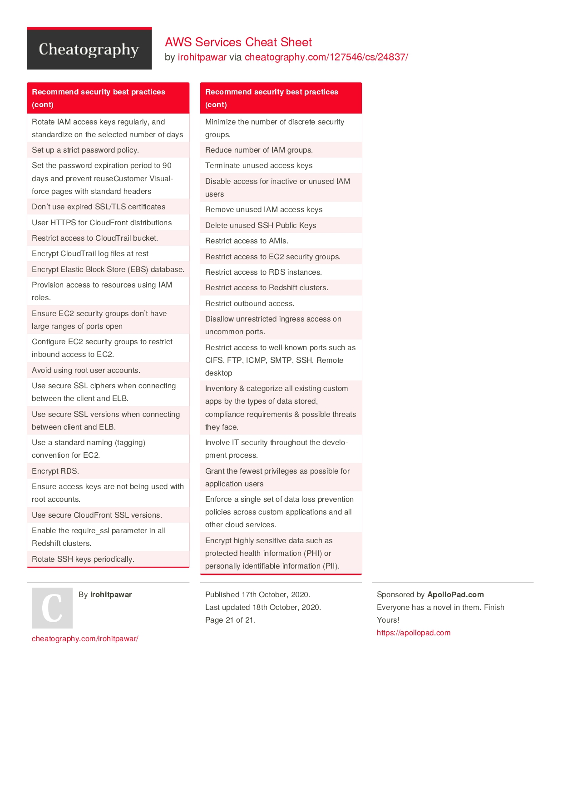
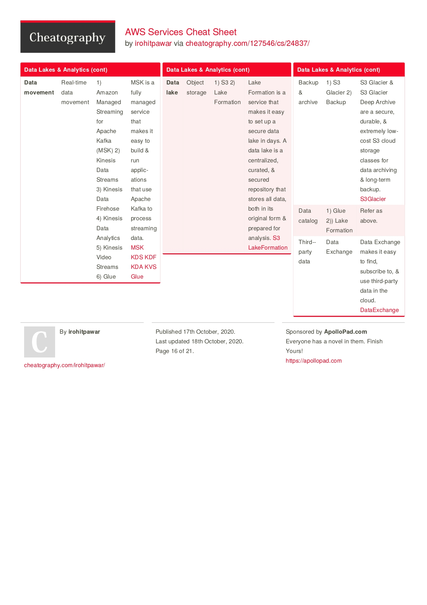
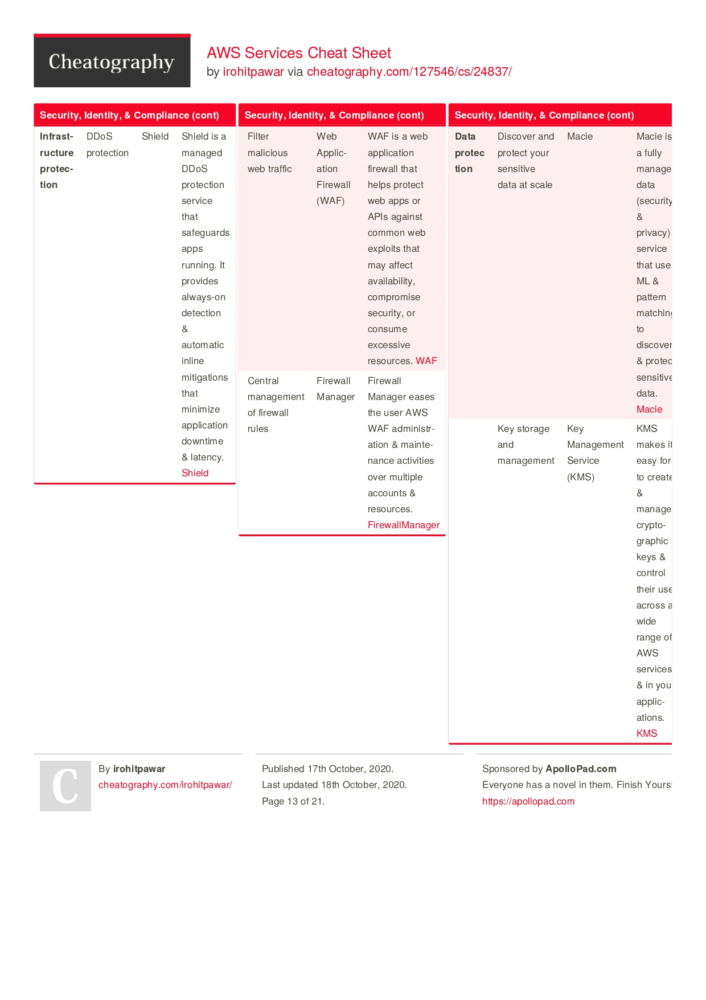
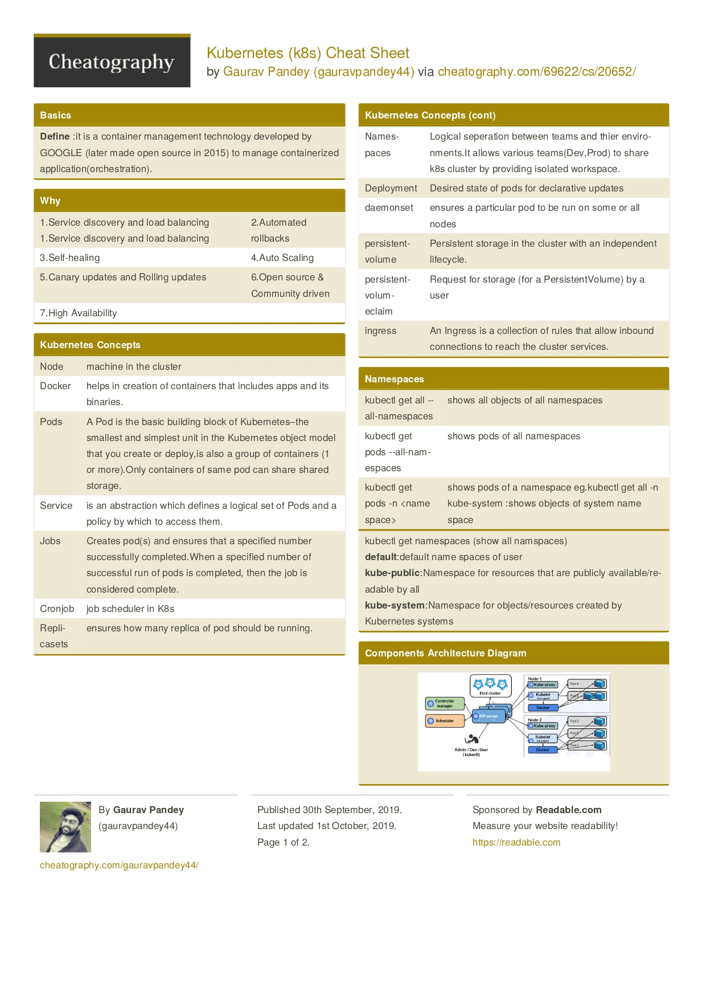
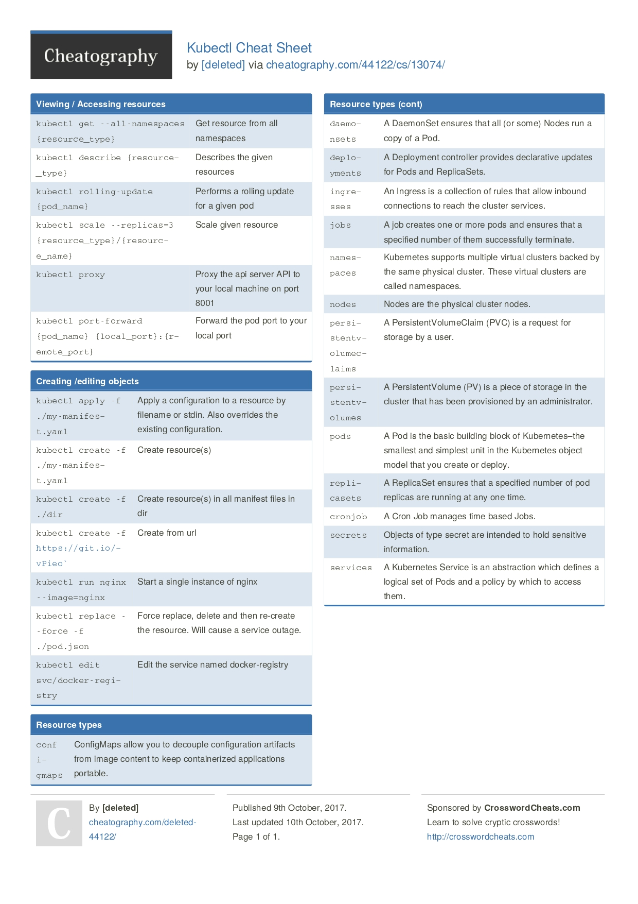
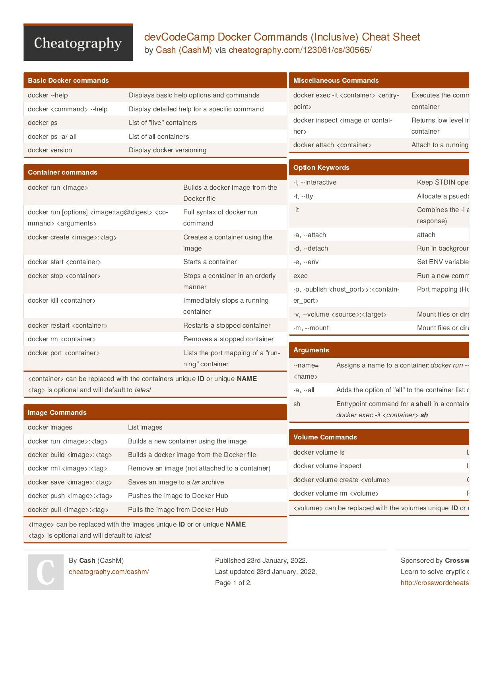
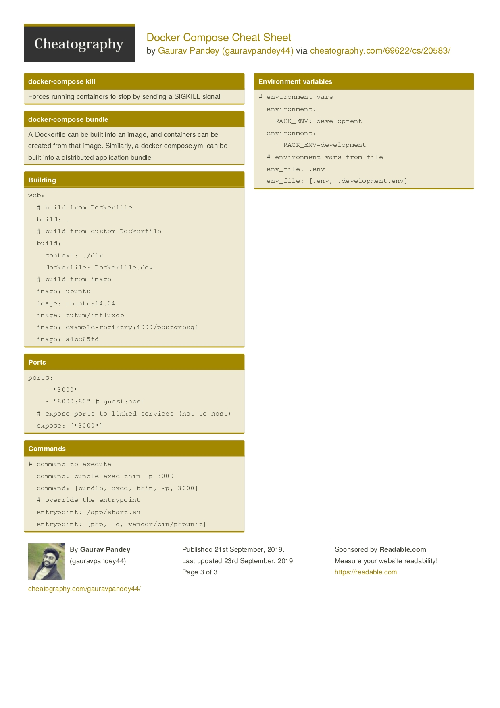

# Cheatsheets
## AWS
- Services

## Kubernetes
- 1

### Concepts
- 1

- 2

- 2

## JS
### Angular
- 2

- 1

## Docker
### Commands
- 1

### Basics
- 1

- 2

## Linux
### CLI
- 1

### Networking
- 1

## General
### RegExp
- 1

## Python
### Django
- Basics

### NumPy
- Cheatsheet #1

### Pandas
- Cheatsheet #1

## YAML
### Docker_Compose
- 1

### Github Actions
- Cheatsheet #1

